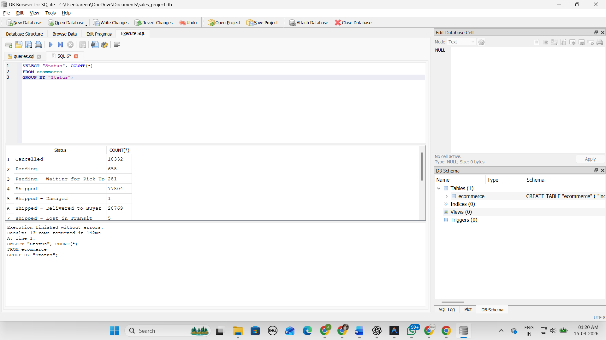

# 🛒 E-commerce SQL Analysis Project

## 📌 Overview
This project focuses on analyzing an e-commerce dataset using SQL to extract meaningful business insights. The analysis includes order trends, fulfilment performance, and order status distribution.

---

## 🛠️ Tools & Technologies
- SQLite (DB Browser)
- SQL

---

## 📂 Dataset
The dataset contains e-commerce order data including:
- Order ID
- Date
- Order Status
- Fulfilment type
- Sales Channel
- Shipping Service Level

The dataset is included in this repository for reference.

---

## 🔍 Key Analysis Performed

### 1. Order Distribution by Status
- Analyzed how orders are distributed across different statuses such as shipped, cancelled, pending, etc.

### 2. Sales Channel Analysis
- Evaluated order volume across different sales channels.

### 3. Fulfilment Performance
- Studied fulfilment methods and their distribution.

### 4. Monthly Order Trends
- Extracted monthly trends using date-based grouping.

### 5. Cancellation Analysis
- Calculated total cancelled orders and their percentage of total orders.

---

## 📊 Sample Outputs

### Order Status Distribution

### Status Percentage Analysis

---

## 📈 Key Insights
- Majority of orders are successfully shipped.
- Approximately **14% of total orders are cancelled**, indicating potential operational inefficiencies.
- Order distribution varies significantly across different statuses.
- Fulfilment and shipping levels impact order outcomes.

---

## 📜 SQL Queries
All queries used in this project are available in:

queries.sql

---

## 🚀 How to Use

1. Open DB Browser for SQLite  
2. Load the dataset (`dataset.csv`)  
3. Execute queries from `queries.sql`  
4. Analyze outputs and insights  

---

## 🎯 Project Objective
The goal of this project is to demonstrate:
- Practical SQL skills (GROUP BY, aggregation, subqueries)
- Data analysis and interpretation
- Ability to extract business insights from raw data

---

## 📌 Author
**Areen Kalra**

---

## ⭐ Key Highlights
- Real-world dataset analysis  
- SQL-based insights generation  
- Business-focused interpretation  
- GitHub project with proof (queries + outputs)
